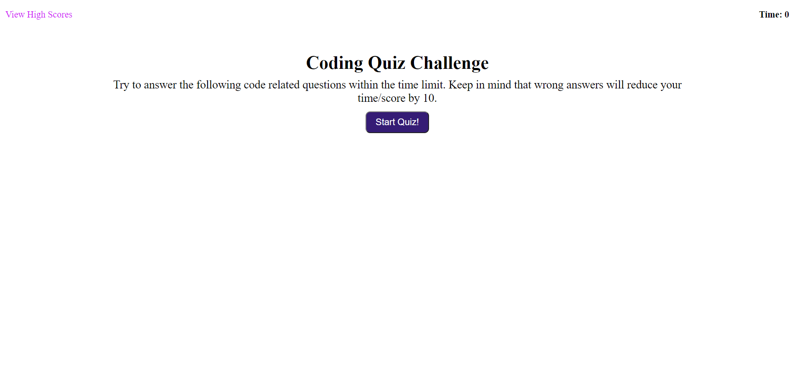

## ChallengeFour: Code Quiz

### Description 
The goal for this challenge was to create a functional quiz that dynamically loads questions and answer options into the DOM, actively responds to the users button clicks, displays wether that answer was right or wrong to the user, and then allows the user to save their score once all the questions are done. Likewise, getting an answer wrong carries a time/point penalty. Unfortunately I hit a snag with being able to store multiple high scores for display in the local storage. I've tried several things in an attempt to remedy this to no avail. But everything else within the quiz functions as intended using Javascript and it has been styled appropriately using CSS. 

### Snapshot

### Live Website Link
https://logandufek.github.io/ChallengeFourCodeQuiz/
